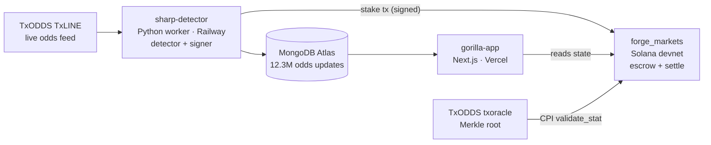

# Gorilla — Demo Video Script (INFRASTRUCTURE framing)

**Runtime:** ~110s. **Framing:** autonomous agent + trustless settlement.
**Not** a strategy/edge demo — the backtest is INCONCLUSIVE (n=41, CI ±35pp).

> **gecko-surf is invisible.** It is internal tooling. It is not named, shown,
> or alluded to anywhere in this video.

---

## Beat 1 — The problem (0:00–0:12)

**On screen:** title card, then a conventional sportsbook page.

> "Every bet you place, someone takes the other side — and that someone
> profits when you lose. Gorilla removes the house entirely. Peer-to-peer
> markets on Solana, settled by an oracle instead of an operator."

**Claim check:** "no house" = architecture, verifiable in `forge_markets`. Safe.

---

## Beat 2 — Real odds, real fixture (0:12–0:32)

**On screen:** `/agent`, odds chart rendering. Zoom the labelling.

> "This is a real World Cup fixture, with real odds captured from TxODDS —
> the same feed professional books price against. Three-point-three million
> odds updates, recorded off the live wire."

**Show:** fixture 18257865 · World Cup · "over/under goals (2) · full match" ·
"Recorded replay · real TxODDS TxLINE capture"

> ⚠️ `TXLineStablePriceDemargined` is the **bookmaker** (id 10021), not the market.
> Don't call it a market on camera. The charted line is over/under goals (2),
> full match — and say "full match", since the period is now what disambiguates it.

**Claim check:** 3,659,679 updates in `gorilla` DB. Chart points are real
readings (`$top`), never averages. ✅

---

## Beat 3 — The agent reads the market (0:32–0:52)

**On screen:** the flagged move highlighted on the chart.

> "The agent watches the line move. Here it detects a shift of three-point-nine
> percentage points — past its three-point threshold — and decides to act."

**Claim check:** +3.918pp over a 3.0pp threshold, real `SharpDetector` output.
Highlight window now derived from the move itself (was a stale-offset bug).

⚠️ **Say "detects a shift" / "decides to act." NOT "spots value," "predicts,"
"finds an edge," or "catches a winner."**

---

## Beat 4 — Autonomous on-chain stake (0:52–1:17)

**On screen:** terminal → agent stakes → Solana Explorer, devnet.

> "No human approves this. The agent builds the transaction, signs it under a
> spend policy it cannot exceed — five-hundredths of a SOL total, one-hundredth
> per bet — and submits it. That's a real transaction, on-chain."

**Show tx:** `62SYrYer1yFRey2No2mcJKdnZCzKtBmfc4w1TpetMZdVwoamVuABQFkKrWXNAgnJ9SjQBEdcKdJ9pGm3yqH8vjZe`
(slot 477090495). Let the explorer load on camera — unedited is the proof.

**Claim check:** real caps 0.05 / 0.01 per bet / 0.02 per fixture. ✅
**Say "devnet" out loud.** Do not imply mainnet.

---

## Beat 5 — Trustless settlement (1:17–1:37)

**On screen:** Merkle proof viewer → settle → claim.

> "Settlement doesn't trust Gorilla. The program verifies the result against a
> Merkle proof published by the oracle, by cross-program invocation. If the
> proof doesn't check out, the payout doesn't happen. Nobody can override it."

**Claim check:** CPI into `txoracle::validate_stat`, devnet oracle
`6pW64gN1s2uqjHkn1unFeEjAwJkPGHoppGvS715wyP2J`. ✅

---

## Beat 5.5 — How it fits together (1:37–1:58) · OPTIONAL

**On screen:** the diagram below, built up in three strokes (feed → agent →
chain), then the whole thing. Static is fine; don't over-animate.

> "Three moving parts, and deliberately no glue code between them. TxODDS
> streams the odds. A Python worker runs the detector and signs. The Solana
> program holds the money and settles it. The worker and the app never call
> each other — they meet on-chain, and in the database. Nothing in the middle
> can quietly change a price or an outcome."

**Say if asked "why no API between them?"** — fewer trusted intermediaries.
The chain is the source of truth for money and outcomes; Mongo only ever holds
*recorded market data*, never balances or results.

**Claim check:** matches the real deployment. Worker = `sharp-detector`
(Railway), app = `gorilla-app` (Vercel), program = `forge_markets` on devnet,
oracle CPI = `txoracle::validate_stat`. No HTTP API exists between the two repos.

> Do **not** name or show internal tooling in this diagram.

---

## Beat 6 — Honest close (1:37–1:50)

**On screen:** summary card.

> "Real odds. An autonomous agent. Real on-chain settlement, with no house and
> no operator discretion. It runs on devnet today — mainnet is a deliberate
> switch, not a demo."

**Optional, and it strengthens you with judges:**
> "Whether the agent's strategy is profitable is an open question — we don't
> have the sample to claim it yet. What's built is the rail it runs on."

---

## DO NOT SAY — every one of these is unsupported

- ❌ "the agent beats the market" / "has an edge" / "is profitable"
- ❌ "+18% ROI" — n=5, CI [−100, +189]. Meaningless.
- ❌ "+2.1% ROI" — CI straddles zero.
- ❌ "the agent caught a winner" (survivorship bias — 1 of 56)
- ❌ "backtested and validated" — the verdict is INCONCLUSIVE
- ❌ any mainnet or real-money implication
- ❌ any mention of internal tooling

## Pre-record checklist

- [x] `#34` landed — period-aware keys, both datasets reloaded, 12.29M rows exact
- [x] 178-vs-335 gap resolved — after reload both are 178
- [x] Charted series verified full-match only (1,739 readings, dataset pinned)
- [x] Move verified in clean data: **75.700 → 79.618 = +3.918 pp**, highlight aligned
- [x] Stale UI/comment text corrected (fixture counts now 102/106 available, 56 settled)
- [ ] `/agent` renders with `MONGODB_URI` set — **founder confirms locally**
- [ ] Explorer tx loads live on camera (do not cut the load)

---

## SHOT LIST — capture order (2026-07-18)

Capture in this order; it front-loads the perishable material. Fixture 18257865
(France v England) kicked off 21:00Z today, so the "match in progress" framing
has a shelf life — get beat 4.5 first.

| # | Beat | Where | Who captures |
|---|---|---|---|
| 1 | **4.5 — a human bets on a live match** | `/settlement`, wallet on **devnet** | founder (browser) |
| 2 | 4 — the agent stakes autonomously | terminal, already recorded | ✅ done |
| 3 | 2/3 — odds chart + flagged move | `/agent` | founder (browser) |
| 4 | 5 — settlement + Merkle proof | `/settlement` proof viewer | founder (browser) |
| 5 | 5.5 — architecture | the mermaid diagram above | designer |

**Beat 4.5 exact steps** (this is the one that just worked):
1. Wallet set to **Devnet** — verify before recording. Pointing at mainnet cost
   us three failed attempts and produced signatures that existed on no cluster.
2. `/settlement` → the featured open market is `4TuMHk…` (fixture 18257865).
3. YES · 0.005 SOL → **Simulate** (must go green) → **Place bet**.
4. Let the explorer tab load on camera. Do not cut the wait.

**Already-verified assets — no re-capture needed:**
- Terminal hero: `sharp-detector/demo/demo_hero.cast` + `.gif`
- Agent's autonomous stake: `62SYrYer…vjZe`, slot 477090495
- Tonight's human stake: `48w3m9zs…Wpnb`, 21:13:45Z, pot 0.0100 → 0.0150

**Known UI issues to avoid on camera** (fixes pending on PR #6):
- The disabled "Place bet" looks identical to the enabled one.
- A 30s confirm timeout is reported as "Bet submitted" — it may not have been
  broadcast at all. Don't film a timeout and call it a success.
- The panel doesn't show which network the wallet is on.
